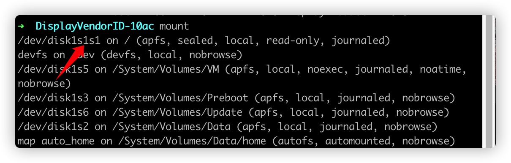

## 参考文档
1. [为 macOS 10.15 开启 HiDPI，让 2K 显示器更舒适](https://sspai.com/post/57549)
2. [SCALED RESOLUTIONS
for your MacBooks external Monitor](https://comsysto.github.io/Display-Override-PropertyList-File-Parser-and-Generator-with-HiDPI-Support-For-Scaled-Resolutions/)
3. [Mount root as writable in Big Sur](https://apple.stackexchange.com/a/395509)

## 前言
本文适合有一定基础的人～最好有一定的英语阅读能力&基本的shell知识

## 操作步骤
先按参考文档1的步骤，进行到`复制 plist 配置文件到系统配置目录`这一步时，就走不通了，因为在Big Sur中，苹果对于权限要求更严格，要通过额外的一系列操作才能获取根目录的写入权限了（参看文档3）。

大概解释一下文档3的意思：
1. 在恢复模式终端运行`csrutil authenticated-root disable`(与文档1中`csrutil disable`方法类似)
2. 重启回系统，终端运行`mount`，如图所示
则`DISK_PATH`为`/dev/disk1s1`（把最后的s+数字去掉）
3. 随便创建一个挂载的目录，文中路径为`~/mount`，即为`MOUNT_PATH`
4. 运行`sudo mount -o nobrowse -t apfs DISK_PATH MOUNT_PATH`（用上文的变量替换）
5. 现在就可以在`~/mount`下修改系统文件了，如：要修改`/temp/1.txt`的文件，则应修改`~/mount/temp/1.txt`
6. 修改完成之后，运行`sudo bless --folder MOUNT_PATH/System/Library/CoreServices --bootefi --create-snapshot`（注意替换路径）
7. 重启，修改即生效。下面就可以愉快地打开rdm修改分辨率了～